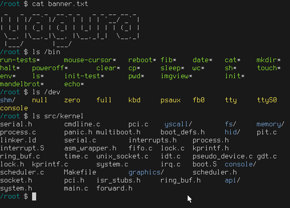

# yagura

[](https://github.com/mosmeh/yagura/actions)

A Unix-like operating system for x86



## How to run

First, install dependencies:

```sh
# on Ubuntu
sudo apt install gcc-multilib cpio qemu-system-x86
```

Then run the following command to build and run:

```sh
make run
```

The following commands start the system with different options:

```sh
make shell # run in text mode

make test # run self-test
```

## Installation on bare-metal

You will need additional dependencies:

```sh
# on Ubuntu
sudo apt install grub2 mtools xorriso
```

The following command creates a disk image file called `disk_image`. You can simply copy it onto a disk and boot it.

```sh
make disk_image
```
