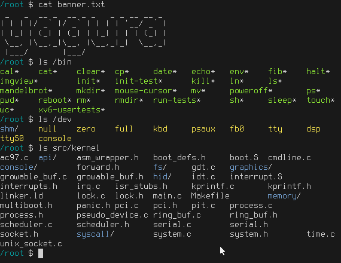

# yagura

[](https://github.com/mosmeh/yagura/actions/workflows/ci.yml)

A Linux-compatible operating system for x86



## Features

- Linux ABI compatibility: many statically or dynamically linked Linux binaries run without recompilation or modification
- Supports i386 and x86_64 architectures
- Preemptive multitasking with SMP support
- ELF loader with dynamic linker support, and `#!` script handling
- Per-process virtual memory with demand paging
- VFS with support for multiple file systems
- Console/TTY stack with ANSI escape sequences, framebuffer/serial console drivers, and virtual consoles
- IPC and I/O multiplexing: pipes, Unix domain sockets, `select`/`poll`
- Basic device drivers: keyboard/mouse, serial port, framebuffer, PCI, ACPI, virtio, etc.
- Small libc and userland utilities

See [Gallery](docs/gallery.md) for more screenshots.

## How to run

First, install dependencies:

```sh
# on Ubuntu
sudo apt install build-essential cpio qemu-system-x86
```

Then run the following command to build and run:

```sh
make run
```

The following commands start the system with different options:

```sh
make serial # run with a serial console
make text # run in VGA text mode
make test # run self-test
```

## Installation on bare-metal

You will need additional dependencies:

```sh
# on Ubuntu
sudo apt install grub2 mtools xorriso
```

The following command creates a disk image file at `build/x86_64/disk_image`. You can simply copy it onto a disk and boot it.

```sh
make disk_image
```

## Inspirations and learning resources

- [xv6](https://github.com/mit-pdos/xv6-public)
- [SerenityOS](https://github.com/SerenityOS/serenity)
- [ToaruOS](https://github.com/klange/toaruos)
- [JamesM's kernel development tutorials](http://www.jamesmolloy.co.uk/tutorial_html/)
- [OSDev Wiki](https://wiki.osdev.org/)
