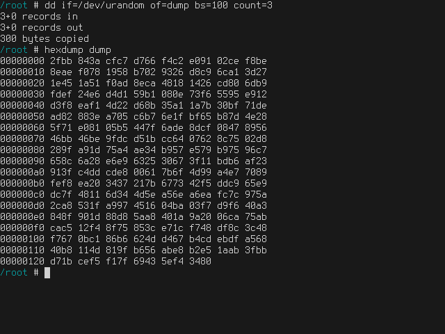
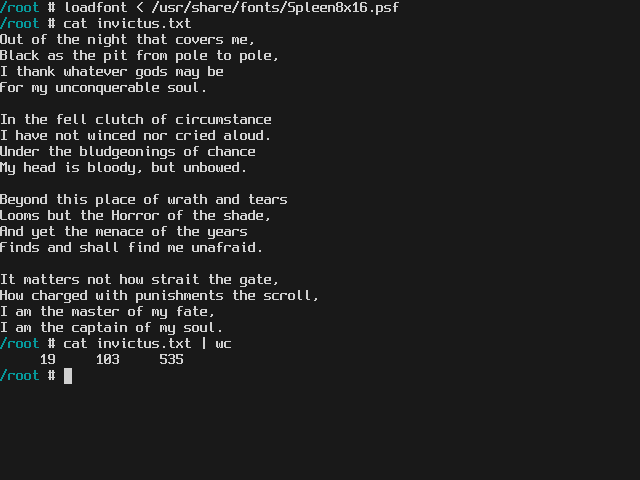
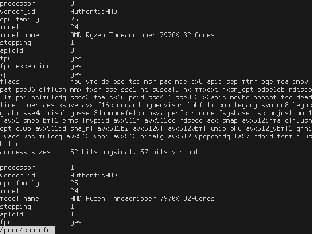
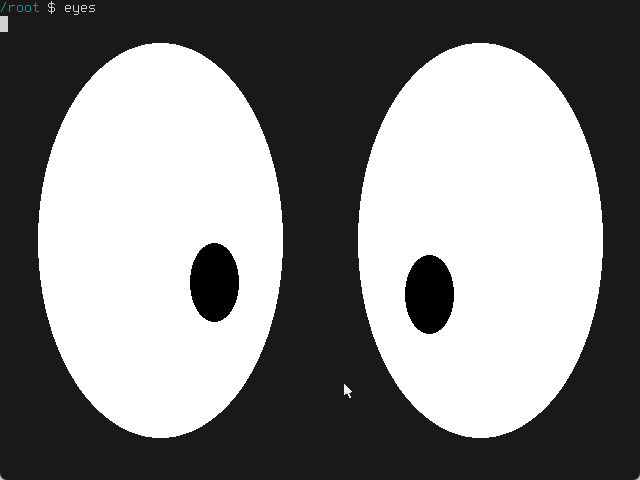
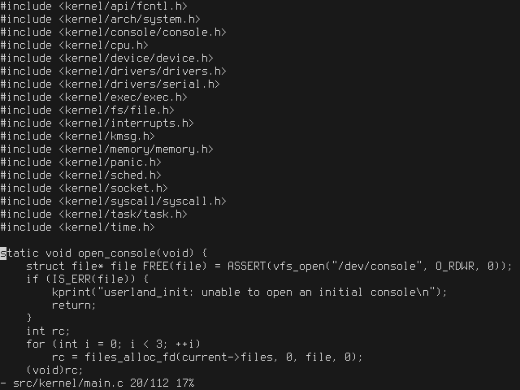
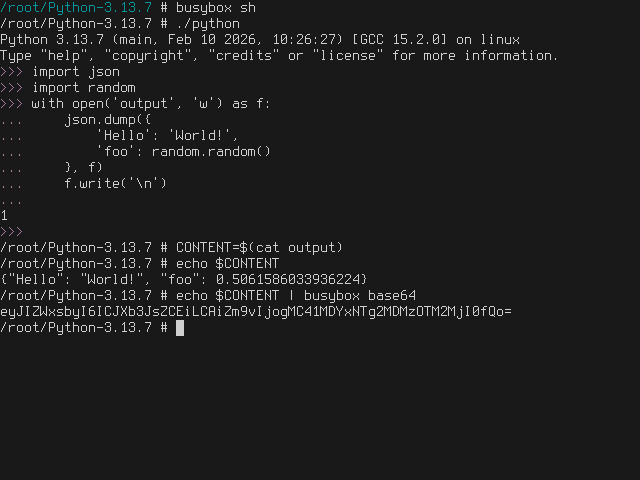
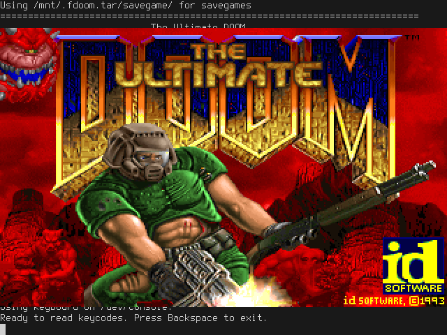
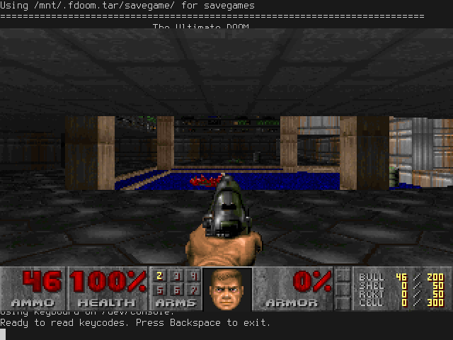

# Gallery

## Basic



---



---

```sh
less /proc/cpuinfo
```



## Graphics



---

```sh
imgview kodim23.qoi
```


---

```sh
mandelbrot
```


## Linux binaries

Because of Linux ABI compatibility, you can copy the Linux binaries to the system and run them. No recompilation or modification is needed.

---

busybox's `vi`



---

Python and busybox's `sh`



---

[fbDOOM](https://github.com/maximevince/fbDOOM), a port of DOOM to the Linux framebuffer



