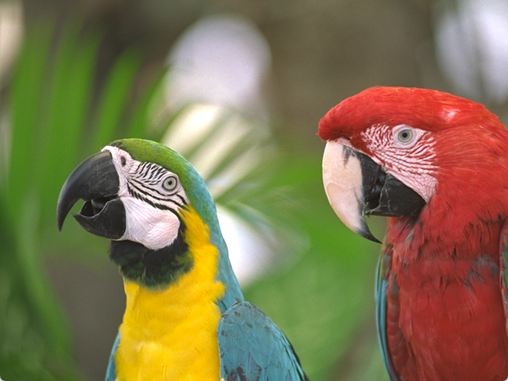

# Gallery

```sh
imgview kodim23.qoi
```



---


```sh
mandelbrot
```


---

```sh
eyes
```


---

```
/root $ sleep 10 &
/root $ ps
  PID CMD
    1 init
    3 moused
    5 sh
    6 sh
    7 sleep
    8 ps
/root $ kill 7
```

---

```
/root $ cat invictus.txt
Out of the night that covers me,
Black as the pit from pole to pole,
I thank whatever gods may be
For my unconquerable soul.

In the fell clutch of circumstance
I have not winced nor cried aloud.
Under the bludgeonings of chance
My head is bloody, but unbowed.

Beyond this place of wrath and tears
Looms but the Horror of the shade,
And yet the menace of the years
Finds and shall find me unafraid.

It matters not how strait the gate,
How charged with punishments the scroll,
I am the master of my fate,
I am the captain of my soul.
/root $ cat invictus.txt | wc
     19     103     535
```

---

```
/root $ play music.qoa
[==========================================>                                  ]
```
